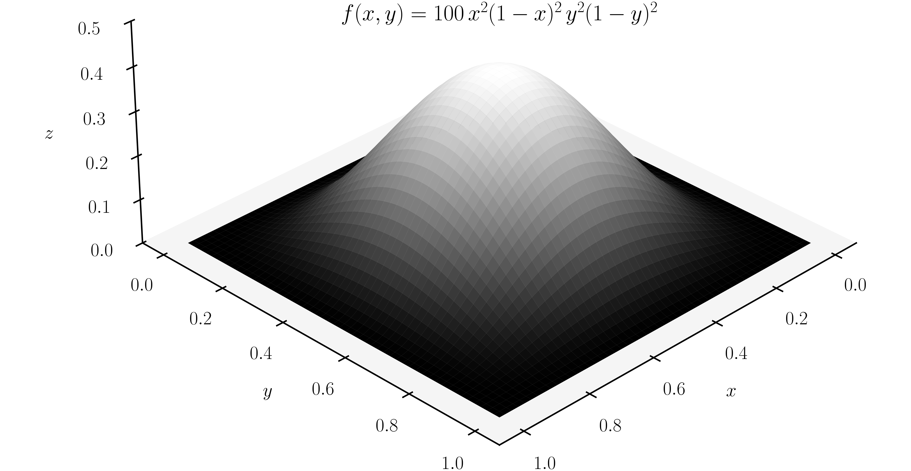
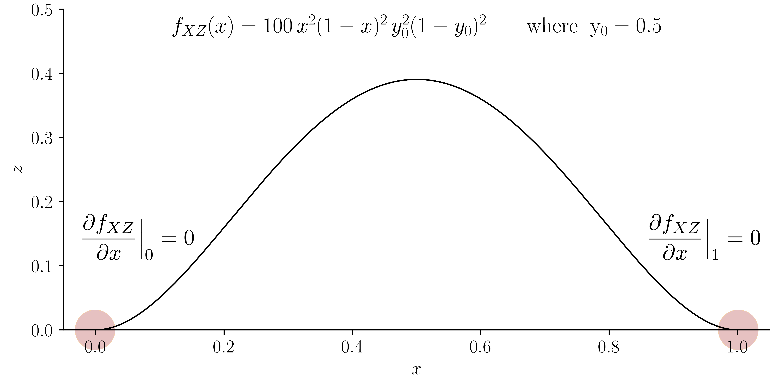
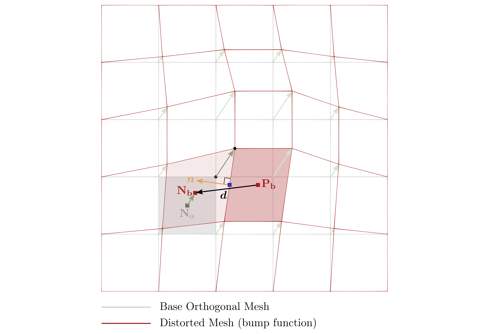
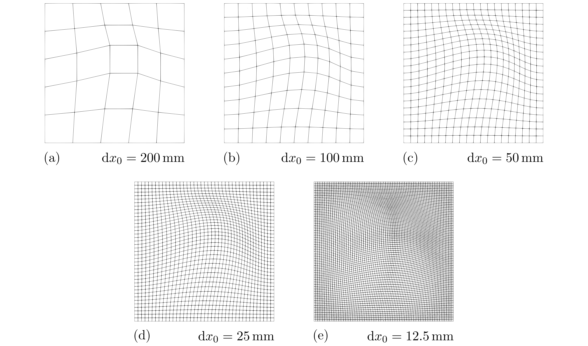
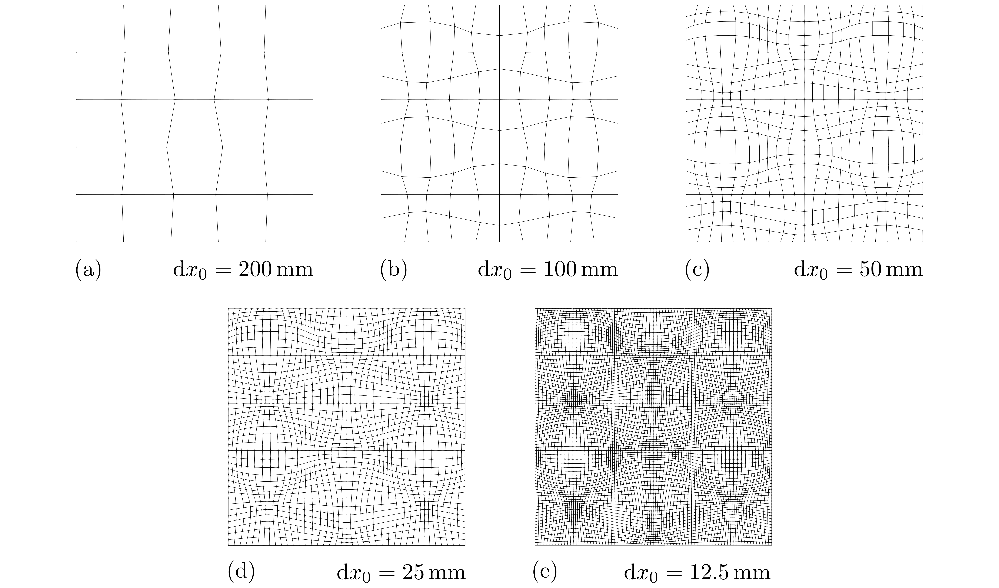
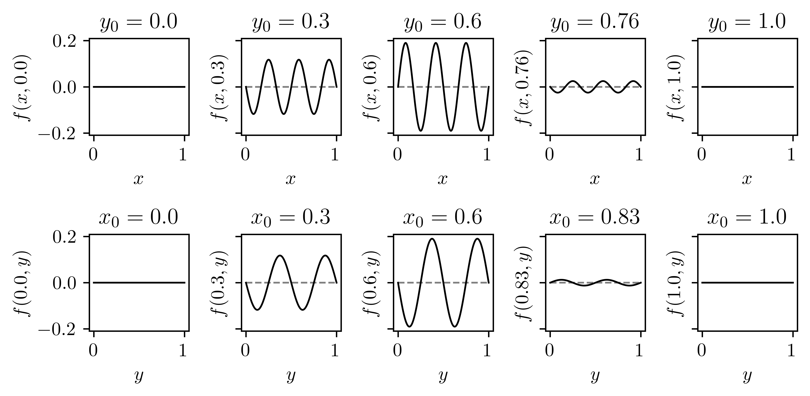
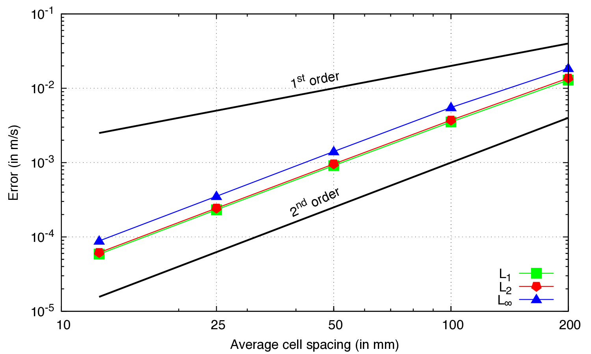

# Decaying Taylor-Green vortex flow: `decayingTaylorGreenVortex`

---

## Tutorial Aims

- Benchmarks the accuracy and order of accuracy of the `newtonIcoFluid` coupled
  Newton-Raphson fluid solver against the analytical solution for the decaying
  Taylor-Green vortex flow case.

## Case Overview

The 2-D, transient Taylor–Green decaying vortex flow has an analytical solution
 for an incompressible laminar, viscous fluid [^erzincanli2013]. Consequently,
 the case is well-suited for benchmarking the accuracy and order of accuracy
 (spatial and temporal) of a discretisation. The spatial domain is taken here as
 the unit square $[0, 1] \times [0, 1]$ m and the analytical solution in
 non-dimensional form is given by
$$
u(x, y, t) = e^{-2\pi^2 t/\text{Re}} \sin(\pi x) \cos(\pi y)
$$
$$
v(x, y, t) = -e^{-2\pi^2 t/\text{Re}} \cos(\pi x) \sin(\pi y)
$$
$$
p(x, y, t) =
    e^{-4\pi^2 t/\text{Re}} \frac{1}{4}
    \left[\cos(2\pi x) + \sin(2\pi y)\right] + C
$$

where $u$ is the non-dimensional $x$ component of velocity, $v$ is the
 non-dimensional $y$ component of velocity, $p$ is the non-dimensional
 pressure, $t$ is time, $Re$ is the Reynolds number taken here to be $10$,
 and $C$ is an arbitrary constant.

The time-varying analytical solution for velocity is prescribed as a boundary
 condition using a custom boundary condition called `decayingTaylorGreenVortexVelocity`
 or a `codedFixedValue` boundary condition as follows:

```c++
    walls
    {
        //type            decayingTaylorGreenVortexVelocity;
        type            codedFixedValue;
        name            decayingTaylorGreenVortexVelocity;

        code
        #{
            const scalar Re = 10;
            const scalar t = db().time().value();
            const scalar pi = constant::mathematical::pi;
            const scalar A = Foam::exp(-2.0*sqr(pi)*t/Re);

            const scalarField x(patch().Cf().component(vector::X));
            const scalarField y(patch().Cf().component(vector::Y));

            const vectorField velocity
            (
                A*Foam::sin(pi*x)*Foam::cos(pi*y)*vector(1, 0, 0)
              - A*Foam::cos(pi*x)*Foam::sin(pi*y)*vector(0, 1, 0)
            );

            operator==(velocity);
        #};

        value           uniform (0 0 0);
    }
```

```note
The difference between the `decayingTaylorGreenVortexVelocity` condition and the
 `codedFixedValue` condition is that `decayingTaylorGreenVortexVelocity` applies
 non-orthogonal corrections at the boundary faces. Without these non-orthogonal
 corrections, the solution will approach zero-order order of accuracy for grids
 which contain finite boundary non-orthogonality in the limit of mesh
 refinement.
```

For pressure, a zero gradient condition is assumed:
 $\boldsymbol{n} \cdot \boldsymbol{\nabla} p = 0$. This condition is enforced
 through a custom condition called `fixedGradientCorrected` or the standard
 `zeroGradient` boundary condition. The `fixedGradientCorrected` condition
 applies boudnary non-orthogonal corrections, whereas `zeroGradient` does not.
 As noted above for the velocity field, boundary non-orthogonal corrections are
 required to achieve the theoretical order of accuracy on grids containing
 boundary non-orthogonality in the limited of mesh refinement.

As all pressure boundaries are of gradient type, the pressure field is defined
 up to a constant. To deal with this in the current case, the pressure in the
 cell closest to the centre of the domain is fixed to 0, although any cell
 could be chosen.

A utility called `initialiseTaylorGreenVortex` is provided in the case, which
 initialises the internal velocity and pressure fields to the analytical
 solution at $t = 0$ s. The initial velocity magnitude field is shown in
 Figure 1.


**Figure 1: The velocity magnitude (in m/s) field at the initial time.**

The case is examined using both static and moving meshes. Four variants of
 static mesh are consdered:

- **Static 1**: an orthogonal mesh, consisting of $N \times N$ quadrilateral
  cells constructed using `blockMesh`. To enable this mesh variant disable
  mesh all distortions by setting `SMOOTHLYDISTORT=0 BUMP=0 PERTURB=0` in the
  configuration settings at the top of the `Allrun` script.
- **Static 2**: starts with the mesh from Static 1 and applies a smooth
  distortion to the internal mesh points using a *bump* function per below. This
  type of mesh can be generated by setting `SMOOTHLYDISTORT=1 BUMP=1 PERTURB=0`
  in the configuration of the `Allrun` script.
  $$
    \mathbf{p}_i' = \mathbf{p}_i +
    \begin{bmatrix}
    A_x \\
    A_y \\
    A_z
    \end{bmatrix}
    f(x, y),
  $$
  $$
    f(x, y) = x^2(1 - x)^2 \, y^2(1 - y)^2.
  $$

- $\mathbf{p}_i$: original position of point $i$ in the orthogonal mesh
- $\mathbf{p}_i'$: new position of point $i$ after distortion
- $\mathbf{A} = (A_x, A_y, A_z)$: magnitude/scale vector

    

    

    As can be seen from the plots, the value of the function $f$ increases as we
    go toward the middle of the domain in the $x-y$ plane. This trend is also
    evident when comparing the distorted mesh with the original orthogonal mesh.

    

    Since the derivative of the bump function is zero at the domain boundary,
    the local face non-orthogonality goes to zero in the limit of mesh
    refinement; that is, the entire mesh becomes effectively orthogonal for fine
    meshes.

    
- **Static 3**: starts with the mesh from Static 1 and applies a smooth distortion
  to the internal points using a sinuisoidal function. This type of
  mesh can be generated by setting `SMOOTHLYDISTORT=1 BUMP=0 PERTURB=0` in the
  configuration in `Allrun`.
  $$
    \mathbf{p}_i' = \mathbf{p}_i +
    \begin{bmatrix}
    f_x(x, y) \\
    f_y(x, y) \\
    f_z(x, y)
    \end{bmatrix},
  $$
  $$
    f_j(x, y) = A_j \sin(B_j \pi x) \sin(C_j \pi y)
    \quad \text{where}\quad j = x, y, z
  $$

- $\mathbf{p}_i$: original position of point $i$ in the orthogonal mesh
- $\mathbf{p}_i'$: new position of point $i$ after distortion
- $\mathbf{A} = (A_x, A_y, A_z)$: magnitude/scale vector
- $\mathbf{B} = (B_x, B_y, B_z)$ and $\mathbf{C} = (C_x, C_y, C_z)$:
  frequency vectors

    

    Like Static 2, the internal mesh faces become orthogonal in the limit of
    mesh refinement; however, unlike Static 2, finite non-orthogonality remains
    at the boundary faces even in the limit of mesh refinement.

    

    This is due to the fact that partial derivatives of the function are
    in general non-zero at the boundary.

    

    In this way, this variant assesses whether the discretisation consistently
    deals with boundary non-orthogonality.
- **Static 4**: starts with the mesh from Static 1 and applies a random
  perturbation to each internal mesh point. This type of mesh can be generated
  by setting `SMOOTHLYDISTORT=0 BUMP=0 PERTURB=1` in the configuration in
  `Allrun`. The perturbation of a point is calculated as a scale factor times
  the local minimum edge length.

  $$
    \mathbf{p}_i' = \mathbf{p}_i +
    \begin{bmatrix}
    \text{rand}_x s_x l_i \\
    \text{rand}_y s_y l_i \\
    \text{rand}_z s_z l_i
    \end{bmatrix}
  $$

- $\mathbf{p}_i$: original position of point $i$ in the orthogonal mesh
- $\mathbf{p}_i'$: new position of point $i$ after perturbation
- $l_i$: local minimum edge length at point $i$
- $\text{rand}_x, \text{rand}_y, \text{rand}_z$: random numbers generated in $x$,
  $y$, and $z$ direction
- $\mathbf{s} = (s_x, s_y, s_z)$: scale factor vector

    Two types of distribution can be chosen:

    1. Gaussian Distribution: $\mathcal{N}(0, 1)$ (mean 0, variance 1)
    2. Uniform Distribution: $\text{Uniform}(-1, 1)$

    This perturbation is applied independently to each mesh level. Unlike
    previous variants, face non-orthogonality remains finite internally and at
    the boundary in this variant. As such, this variant is the most challenge
    static mesh from the discretisation perspective.

    

    Assessing the order of accuracy on these types of grids may require multiple
    simulations at each grid level using different random perturbation
    parameters; a best fit approach can then be used to determine the order of
    accuracy from the error vs average mesh spacing plots.

In addition to the static mesh variants, four moving mesh variants are considered:

- **Moving 1**: starting with the mesh from Static 1, a time-varying mesh motion
  is prescribed. The mesh is moved such that all mesh faces remain orthogonal.
  This allows the effect of mesh motion to be assessed independently of mesh
  non-orthogonality and skewness.
- **Moving 2**: the smooth mesh distortion from Static 2 is applied as a
  time-varying mesh motion. Like Static 2, internal and boundary face
  non-orthogonality go to zero in the limit of mesh refinement.
- **Moving 3**: the smooth mesh distortion of Static 3 is applied as a
  time-varying mesh motion. Like Static 3, internal face non-orthogonality go to
  zero in the limit of mesh refinement but boundary face non-orthogonality
  remains finite.

The base case contains multiple `blockMeshDict` files of increasing mesh
 density, which can be selected with the `-dict` option, e.g.
 `blockMesh -dict system/blockMeshDict.uniform.3`. The `system/blockMeshDict.uniform.1`
 dictionary defines a mesh with $5 \times 5$ cells, and the number of cells in
 each direction is double for subsequent grids, e.g., `system/blockMeshDict.uniform.2`
 contains $10 \times 10$ cells. The `*.graded.*` versions of the `blockMeshDict`
 dictionaries (e.g., `system/blockMeshDict.graded.2`) contain the same number of
 cells as the `*.uniform.*` versions, but apply mesh grading towards the walls,
 i.e. the cells are smaller near the walls and larger near the domain centre.

The case contains a function object, which calculates the exact velocity field
 `exactU` and the error norm in the velocity field ($L_1$, $L_2$, and
 $L_\infty$) at $t = 0.4$ s, as defined at the bottom of
 `system/controlDict`:

```c++
functions
{
    error
    {
        name    error;
        type    coded;
        libs    (utilityFunctionObjects);

        codeEnd
        #{
            // Define the exact U
            const scalar Re = 10;
            const scalar t = time().value();
            const scalar pi = constant::mathematical::pi;
            const scalar A = Foam::exp(-2.0*sqr(pi)*t/Re);

            volVectorField exactU
            (
                IOobject
                (
                    "exactU",
                    time().timeName(),
                    mesh(),
                    IOobject::NO_READ,
                    IOobject::AUTO_WRITE
                ),
                mesh(),
                dimensionedVector(dimVelocity, Zero)
            );

            {
                const scalarField x(mesh().C().component(vector::X));
                const scalarField y(mesh().C().component(vector::Y));

                exactU.primitiveFieldRef() =
                    A*Foam::sin(pi*x)*Foam::cos(pi*y)*vector(1, 0, 0)
                  - A*Foam::cos(pi*x)*Foam::sin(pi*y)*vector(0, 1, 0);
            }

            forAll(exactU.boundaryField(), patchI)
            {
                if (exactU.boundaryField()[patchI].size())
                {
                    const scalarField x
                    (
                        mesh().C().boundaryField()[patchI].component(vector::X)
                    );
                    const scalarField y
                    (
                        mesh().C().boundaryField()[patchI].component(vector::Y)
                    );

                    exactU.boundaryFieldRef()[patchI] =
                        A*Foam::sin(pi*x)*Foam::cos(pi*y)*vector(1, 0, 0)
                      - A*Foam::cos(pi*x)*Foam::sin(pi*y)*vector(0, 1, 0);
                }
            }

            exactU.correctBoundaryConditions();

            Info<< "Writing exactU to " << time().timeName() << endl;
            exactU.write();

            // Lookup U
            const auto& U = mesh().lookupObject<volVectorField>("U");

            // Calculate the error
            const volScalarField magError("magError", mag(U - exactU));
            Info<< "Writing magError to " << time().timeName() << endl;
            magError.write();
            const scalarField& Vol = mesh().V().field();
            const scalar totalVol = gSum(Vol);
            const vectorField diff(U - exactU);

            // Arithmetic errors
            // const scalar errorL1 = gAverage(mag(diff));
            // const scalar errorL2 = sqrt(gAverage(magSqr(diff)));
            // const scalar errorLInf = gMax(mag(diff));

            // Volume-weighted errors
            const scalar errorL1 = gSum(mag(diff*Vol))/totalVol;
            const scalar errorL2 = sqrt(gSum(magSqr(diff)*Vol)/totalVol);
            const scalar errorLInf = gMax(mag(diff));

            Info<< "Velocity errors norms:" << nl
                << "    mean L1 = " << errorL1 << nl
                << "    mean L2 = " << errorL2 << nl
                << "    LInf = " << errorLInf << endl;
        #};
    }
}
```

In this case, the `newtonIcoFluid` fluid solver is used, which solves the
 incompressible Navier-Stokes equations using a Jacobian-free Newton-Krylov
 approach [^cardiff2025] built on the PETSc SNES nonlinear solver. The
 `newtonIcoFluid` settings are defined in `constant/fluidProperties`, where three
 types of settings are given: (i) numerical smoothing parameter for quelling
 checkerboarding oscillations, (ii) pressure reference point, and (iii) the
 PETSc options file, where the PETSc SNES nonlinear solver settings are defined.

```c++
fluidModel newtonIcoFluid;

newtonIcoFluidCoeffs
{
    // Smoothing terms
    // Trottenberg gives 1/16 for Stokes flow
    omega     [0 -2 1 0 0 0 0] 0.0625;
    localReRef 1e6;
    omegaExponent 1.0;
    alphaU    1.0;

    // Set the pressure to zero at the centre cell
    pRefPoint (0.5 0.5 0);
    pRefValue 0.0;

    // PETSc options file used by PETSc SNES
    optionsFile petscOptions.lu;
}
```

The `petscOptions.lu` file currently specifies a Jacobian-free Newton-Krylov
 solution approach, where the approximate Jacobian is inverted using a direct LU
 solver and L-GMRES is used as the iterative linear solver. Key settings from
 `petscOptions.lu` are shown below:

```bash
-snes_type newtonls
-snes_linesearch_type l2
-snes_max_it 1000
-snes_monitor
-snes_converged_reason
-snes_mf
-snes_mf_operator
-ksp_type lgmres
-ksp_gmres_restart 400
-ksp_converged_reason
-ksp_max_it 400
-pc_type bjacobi
-sub_pc_type lu
```

## Running the Case

The case can be run using the included `Allrun` script located in the template
 case (`decayingTaylorGreenVortex/base`) directory or by executing the `Allrun`
 script in the parent `decayingTaylorGreenVortex` directory. The `decayingTaylorGreenVortex/Allrun`
 script runs multiple cases based on the configurations and mesh indices given
 at the top of the script, e.g.

```bash
configs=(
    "BASE=base NAME=hex.lu GRADED=1 \
    MOVING=0 ORTHOGONAL=0 \
    SMOOTHLYDISTORT=1 PERTURB=0 BUMP=0 \
    PIMPLEFOAM=1"
)

# ...

START_MESH=1
END_MESH=5
```

The `decayingTaylorGreenVortex/Allrun` script essentially performs five steps
 for each case configuration, in addition to perturbing the mesh, extracting
 results and generating plots:

```bash
# Build the utility for initialising the solution
wmake initialiseTaylorGreenVortex

# Copy 0.orig to 0
restore0Dir

# Create the mesh
runApplication blockMesh

# Initialise the velocity and pressure initial fields with the analytical
# solutions
runApplication initialiseTaylorGreenVortex

# Run the solver
runApplication solids4Foam
```

## Expected Results

According to the analytical solutions given above, the magnitude of the velocity
 and pressure decrease in time, resulting the decay of the vortex. An animation
 of the velocity magnitude from $t = 0$ s to $t = 0.4$ s is shown in Video 1.
 The velocity streamlines, shown in black, are seen to remain stationary as the
 direction of the velocity field remains unchanged in time; instead, only its
 magnitude decreases.


**Video 1: Evolution of the velocity magnitude field**

The function object described above prints out the velocity field error norms at
 the end of the run after the last time step finished:

```console
...

Time = 0.4

Evolving fluid model: newtonIcoFluid
Solving the fluid for U and p
  0 SNES Function norm 4.822871490313e-03
    Linear solve converged due to CONVERGED_RTOL iterations 2
  1 SNES Function norm 6.547206455521e-09
    Linear solve converged due to CONVERGED_RTOL iterations 2
  2 SNES Function norm 3.778722236831e-14
  Nonlinear solve converged due to CONVERGED_FNORM_RELATIVE iterations 2
ExecutionTime = 4.12 s  ClockTime = 5 s

Writing exactU to 0.4
Velocity errors norms:
    mean L1 = 0.000910565
    mean L2 = 0.000957898
    LInf = 0.00140902

End
```

Re-running the case for different mesh densities allows the order of accuracy of
 the solver to be assessed. Below the errors are given for five mesh spacings,
 where a spacing of $0.05$ m corresponds to the $20 \times 20$ grid described
 above ($1$ m divided into $20$ gives $0.05$ m).

```text
# dx L1 L2 LInf
0.2 0.0128716 0.013683 0.0185237
0.1 0.00352244 0.00372265 0.00551404
0.05 0.000910565 0.000957898 0.00140902
0.025 0.000232169 0.000243816 0.000352236
0.0125 5.86993e-05 6.15957e-05 8.84018e-05
```

Plotting these errors on a log-log plot demonstrates that second-order is
 achieved as expected (Figure 2), where the $L_\infty$ (maximum) errors are
 larger than the $L_1$ and $L_2$ (average) errors, which is also as
 expected.



**Figure 2: The velocity error norms as a function of mesh spacing.**

## References

[^erzincanli2013]: [Erzincanli, B. and Sahin, M. (2013). An arbitrary
 Lagrangian–Eulerian formulation for solving moving boundary problems with
 large displacement and rotations, Journal of Computational Physics 255,
 660–679](https://doi.org/10.1016/j.jcp.2013.08.038)

[^cardiff2025]: [Cardiff, P., Armfield, D., Tuković, Ž. and Batistić, I. (2025).
 Implementing a Jacobian-free Newton-Krylov method in OpenFOAM Applications to
 solids fluids and fluid-solid interaction, 20th OpenFOAM Workshop, Vienna,
 Austria. July 2025](https://doi.org/10.13140/RG.2.2.35692.48009)
